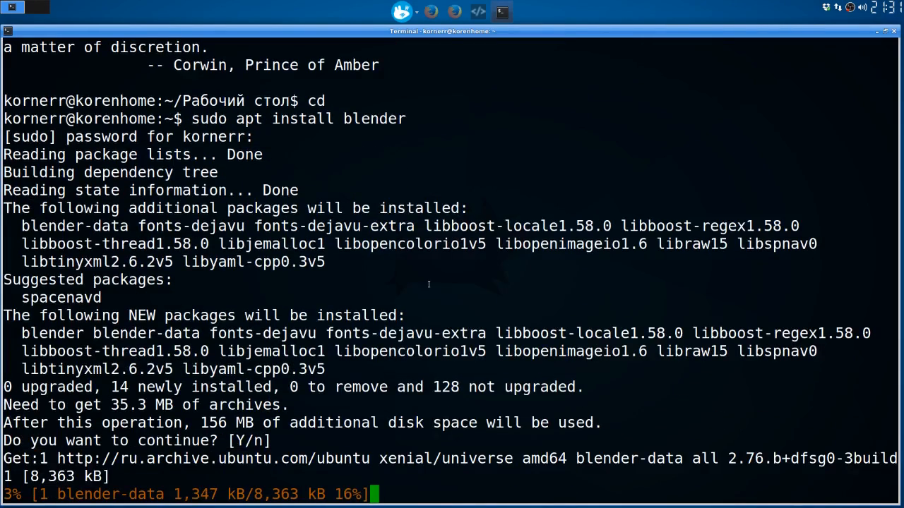
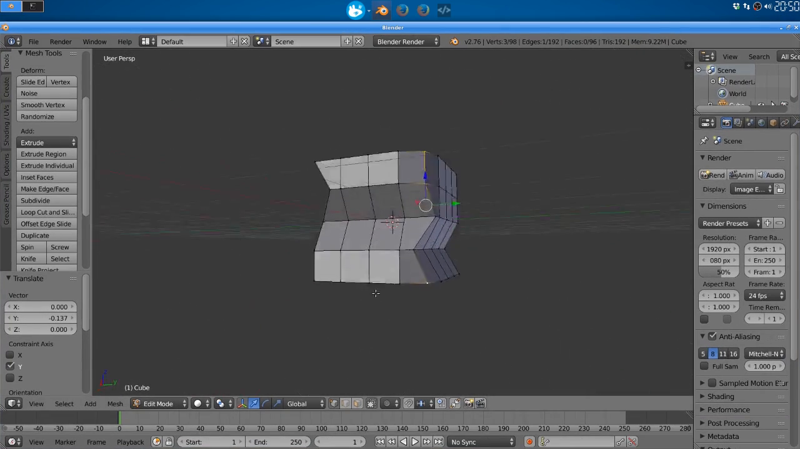
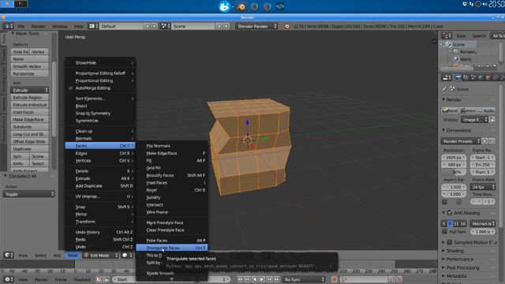
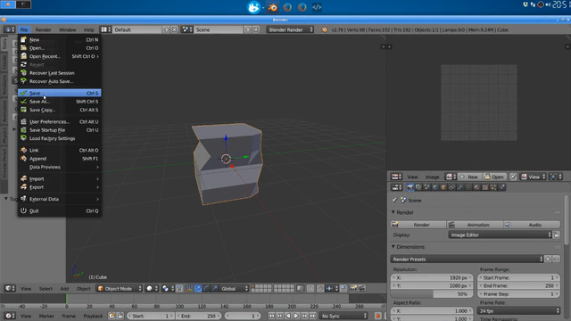
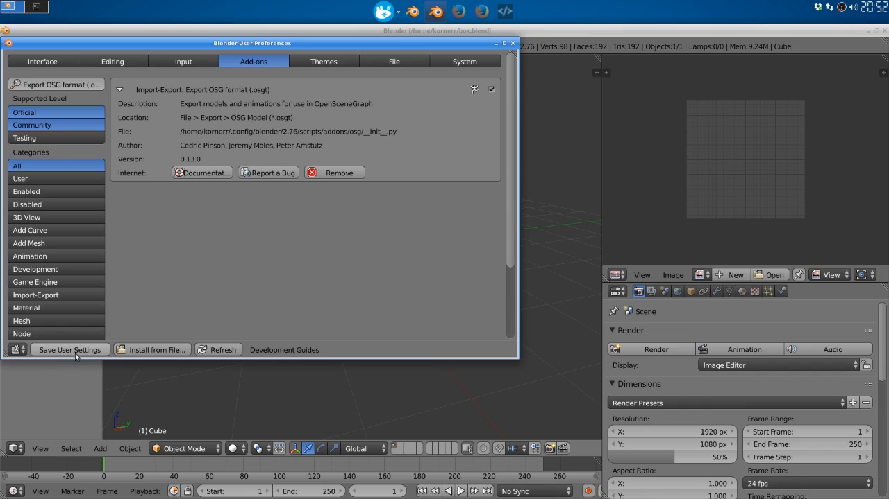
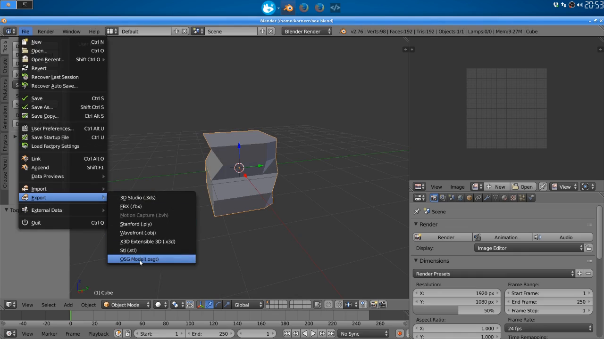
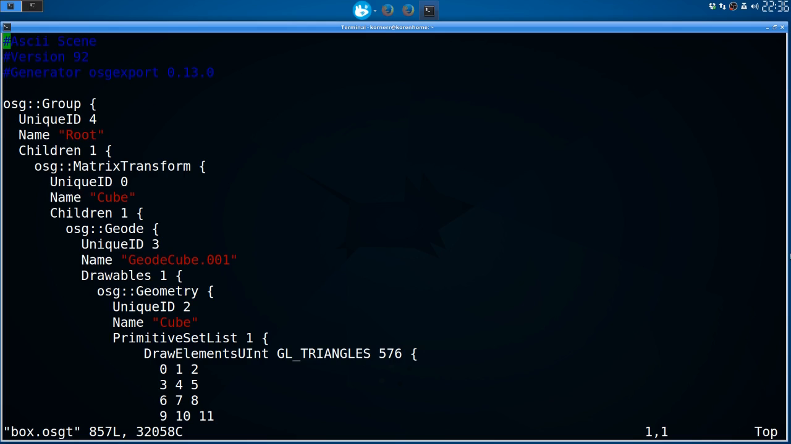

Table of contents
=================

* [Overview](#overview)
* [Video](#video)
* [Steps](#steps)
  * [1.1.1. Install Blender](#step-install-blender)
  * [1.1.2. Create a deformed cube](#step-create-cube)
  * [1.1.3. Triangulate the cube: CRITICAL for mobile/web](#step-triangulate)
  * [1.1.4. UV unwrap the cube for later texturing](#step-unwrap)
  * [1.1.5. Save the model](#step-save)
  * [1.1.6. Install Blender-to-OpenSceneGraph exporter](#step-install-exporter)
  * [1.1.7. Export Blender model to OpenSceneGraph format](#step-export)
  * [1.1.8. Take a look at 'box.osgt' file](#step-observe)
* [Resources](#resources)

<a name="overview"/>

Overview
========

This tutorial is part of [OpenSceneGraph cross-platform guide](http://github.com/OGStudio/openscenegraph-cross-platform-guide).

In this tutorial we create a simple cube in [Blender](http://blender.org) that
OpenSceneGraph will render later.

<a name="video"/>

Video
=====

[YouTube](https://youtu.be/A2AvLLgJq18) | [Download](readme/video.mp4)

Video depicts Blender installation under Xubuntu 16.04.

<a name="steps"/>

Steps
=====

**Note**: steps below use frames from the video as screenshots.
Watch the video to see all details.

<a name="step-install-blender"/>

1.1.1. Install Blender
----------------------

  

  To install Blender on Debian based distributions, run the following command:

  `sudo apt install blender`

  If you're on macOS or Windows, you can get Blender from its homepage: http://blender.org

<a name="step-create-cube"/>

1.1.2. Create a deformed cube
-----------------------------

  

  We create the deformed cube so that it's easy to know which side we're looking
  at when we see it rendered later.

<a name="step-triangulate"/>

1.1.3. Triangulate the cube: CRITICAL for mobile/web
----------------------------------------------------

  

  Both mobile and web platforms use OpenGL ES to perform 3D rendering,
  which is different from OpenGL used on desktops. One specific aspect
  is that mobile and web only render triangles, not quads.

  By default, Blender uses quads. That's why we manually triangulate
  our model to make sure it can be displayed on all platforms.

<a name="step-unwrap"/>

1.1.4. UV unwrap the cube for later texturing
---------------------------------------------

  

  This is necessary for correct texturing and calculating visual effects
  in shaders later.

<a name="step-save"/>

1.1.5. Save the model
---------------------

  

  Save the model for later reference.

<a name="step-install-exporter"/>

1.1.6. Install Blender-to-OpenSceneGraph exporter
-------------------------------------------------

  

  Install exporter to produce OpenSceneGraph models from within Blender.

<a name="step-export"/>

1.1.7. Export Blender model to OpenSceneGraph format
----------------------------------------------------

  

  Export the model to OpenSceneGraph format.

<a name="step-observe"/>

1.1.8. Take a look at 'box.osgt' file
-------------------------------------

  

  Exported OpenSceneGraph format (`*.osgt`) is a text file.

  There also exist binary (`*.osg`, `*.osgb`) and xml (`*.osgx`) formats.
  You might want to use them to speed up loading times.

<a name="resources"/>

Resources
=========

* [Blender file](result/box.blend)
* [OpenSceneGraph file](result/box.osgt)

