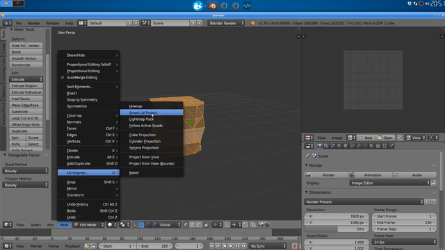
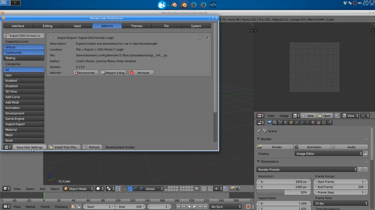

1.1. Create a cube
==================

This article is part of [OpenSceneGraph cross platform guide](..).

In this article we create a simple cube in [Blender](http://blender.org) that
OpenSceneGraph will render later.

Video
=====

[YouTube](https://youtu.be/A2AvLLgJq18) | [Download](video.mp4)

Steps
=======

* *1.1.1. Install Blender*

  

  The video depicts Blender installation under Debian based distribution
  (specifically Xubuntu 16.04).

  To install Blender on Debian based distributions, run the following command:

  `sudo apt install blender`

  If you're on macOS or Windows, you can get Blender from its homepage: http://blender.org

* *1.1.2. Create a deformed cube*

  

  We create the deformed cube so that it's easy to know which side we're looking
  at when we see it rendered later.

* *1.1.3. Triangulate the cube: CRITICAL for mobile/web*

  

  Both mobile and web platforms use OpenGL ES to perform 3D rendering,
  which is different from OpenGL used on desktops. One specific aspect
  is that mobile and web only render triangles, not quads.

  By default, Blender uses quads. That's why we manually triangulate
  our model to make sure it can be displayed on all platforms.

* *1.1.4. UV unwrap the cube for later texturing*

  

* *1.1.5. Save the model*

  

* *1.1.6. Install Blender-to-OpenSceneGraph exporter*

  

* *1.1.7. Export Blender model to OpenSceneGraph format*

  

* *1.1.8. Take a look at 'box.osgt' file*

  

