Table of contents
=================

* [Overview](#overview)
* [Video](#video)
* [Steps](#steps)
  * [1.2.1. Find OpenSceneGraph repository](#step-find)
  * [1.2.2. Install git to get OpenSceneGraph](#step-install-git)
  * [1.2.3. Get latest OpenSceneGraph](#step-get-osg)
  * [1.2.4. Create build directory](#step-build-dir)
  * [1.2.5. Try to configure OpenSceneGraph with CMake](#step-try-cfg)
  * [1.2.6. Install CMake to configure OpenSceneGraph](#step-install-cmake)
  * [1.2.7. Try to configure OpenSceneGraph once again](#step-cfg)
  * [1.2.8. Observe configuration errors](#step-cfg-errors)
  * [1.2.9. Install missing OpenGL libraries](#step-install-gl)
  * [1.2.10. Configure OpenSceneGraph](#step-cfg-osg)
  * [1.2.11. Observe found OpenGL library location](#step-gl-path)
  * [1.2.12. Build OpenSceneGraph](#step-build)
  * [1.2.13. Install OpenSceneGraph](#step-install)
  * [1.2.14. Try to check 'box.osgt' with 'osgviewer'](#step-try-check)
  * [1.2.15. Locate OpenSceneGraph libraries](#step-locate)
  * [1.2.16. Tell dynamic linker where to find OpenSceneGraph libraries](#step-linker)
  * [1.2.17. Check 'box.osgt' with 'osgviewer'](#step-check)

<a name="overview"/>

Overview
========

This tutorial is part of [OpenSceneGraph cross-platform guide](http://github.com/OGStudio/openscenegraph-cross-platform-guide).

In this tutorial we install OpenSceneGraph under Linux and take a look
at the cube with **osgviewer** tool.

<a name="video"/>

Video
=====

[YouTube](https://youtu.be/3LF0mvrQ0iE) | [Download](readme/video.mp4)

Video depicts OpenSceneGraph installation under Xubuntu 16.04.

<a name="steps"/>

Steps
=====

<a name="step-find"/>

1.2.1. Find OpenSceneGraph repository
-------------------------------------

  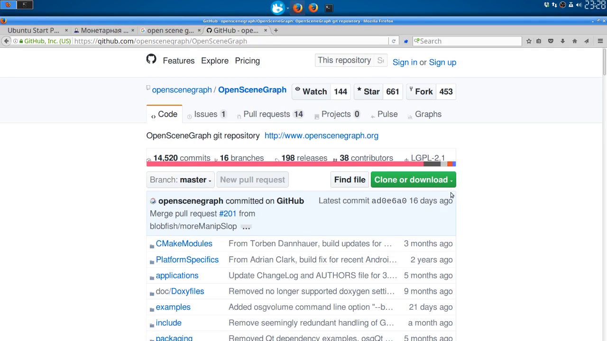

  Find OpenSceneGraph repository at the website.

<a name="step-install-git"/>

1.2.2. Install git to get OpenSceneGraph
----------------------------------------

  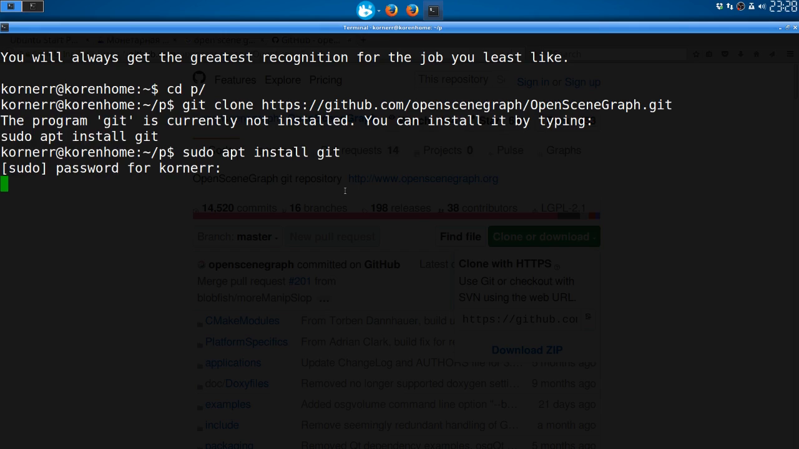

  Since [OpenSceneGraph is hosted at GitHub](https://github.com/openscenegraph/OpenSceneGraph),
  we need to install git.

  To install git on Debian based distributions, run the following command:

  `sudo apt install git`

<a name="step-get-osg"/>

1.2.3. Get latest OpenSceneGraph
--------------------------------

  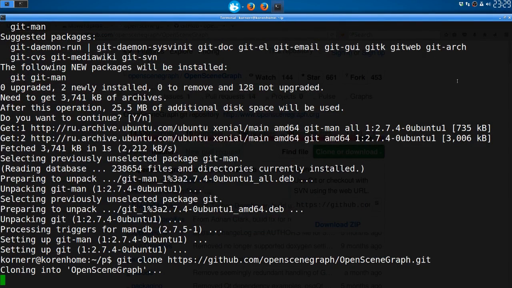

  Get the latest copy of OpenSceneGraph with the following command:

  `git clone https://github.com/openscenegraph/OpenSceneGraph.git`

<a name="step-build-dir"/>

1.2.4. Create build directory
-----------------------------

  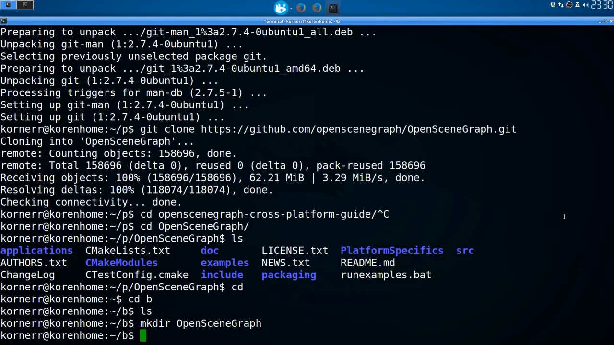
  
  OpenSceneGraph uses CMake build system, which supports out-of-source builds.
  We create a build directory to keep generated (built) content separate
  from the original source.

<a name="step-try-cfg"/>

1.2.5. Try to configure OpenSceneGraph with CMake
-------------------------------------------------

  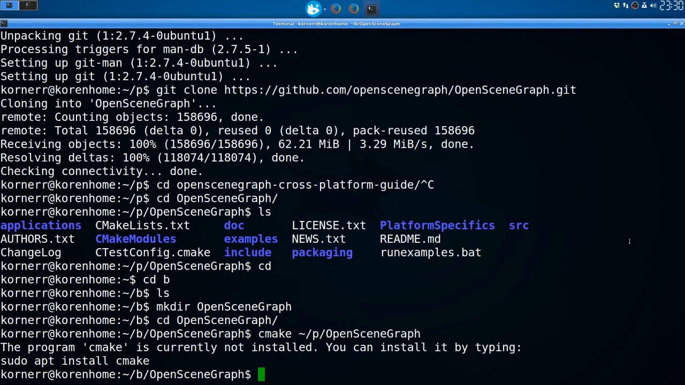

  Before we can build OpenSceneGraph, we need to configure the build.

  However, CMake is not yet installed.

<a name="step-install-cmake"/>

1.2.6. Install CMake to configure OpenSceneGraph
-------------------------------------------------

  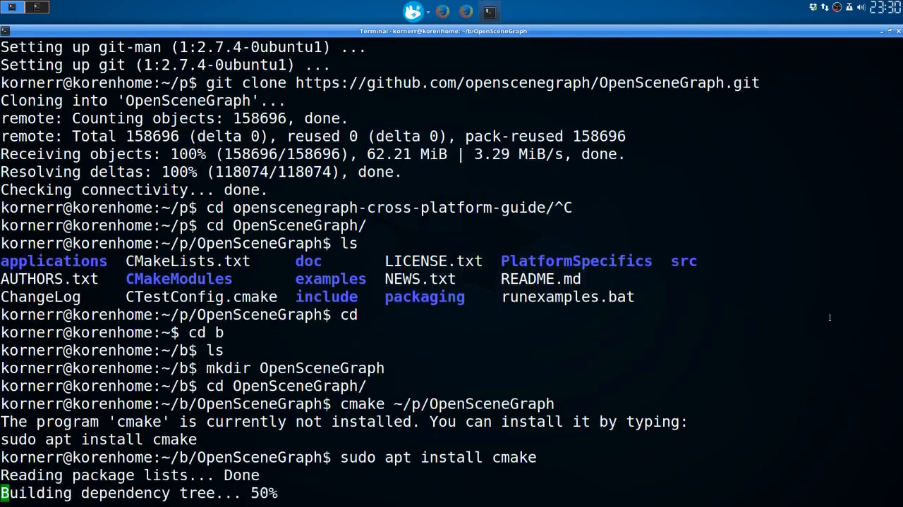

  To install CMake on Debian based distributions, run the following command:

  `sudo apt install cmake`

<a name="step-cfg"/>

1.2.7. Try to configure OpenSceneGraph once again
-------------------------------------------------

  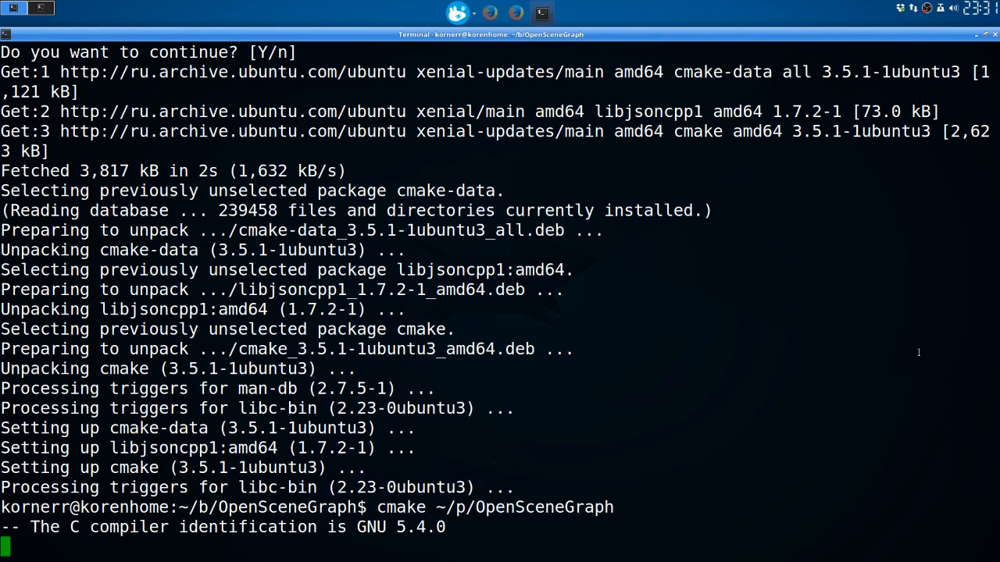

  Configure OpenSceneGraph build with the following commands:
 
  `cd /path/to/build/dir`

   `cmake /path/to/source/dir`

  We use default configuration without specifying anything.

<a name="step-cfg-errors"/>

1.2.8. Observe configuration errors
-------------------------------------

  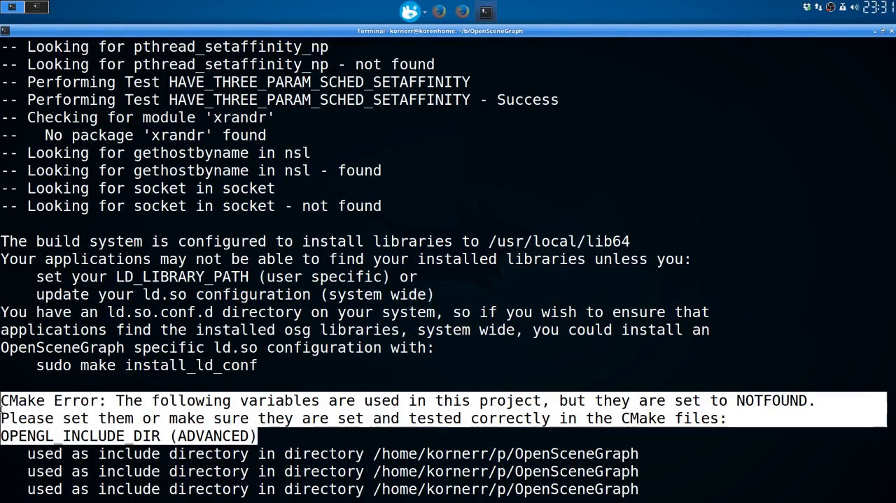

  As you see, configuration process could not resolve `OPENGL_INCLUDE_DIR`
  variable. This means CMake could not find OpenGL libraries.

<a name="step-install-gl"/>

1.2.9. Install missing OpenGL libraries
---------------------------------------

  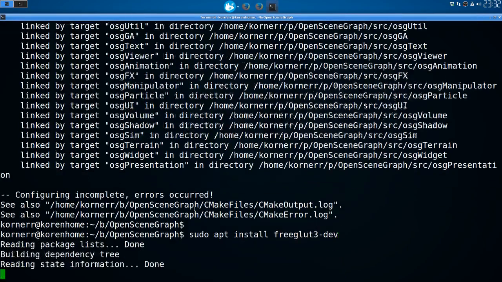

  The easiest way to install OpenGL libraries is to install GLUT development package,
  which will bring OpenGL libraries in as a dependency.

  To install GLUT development package on Debian based distributions,
  run the following command:

  `sudo apt install freeglut3-dev`

<a name="step-cfg-osg"/>

1.2.10. Configure OpenSceneGraph
--------------------------------

  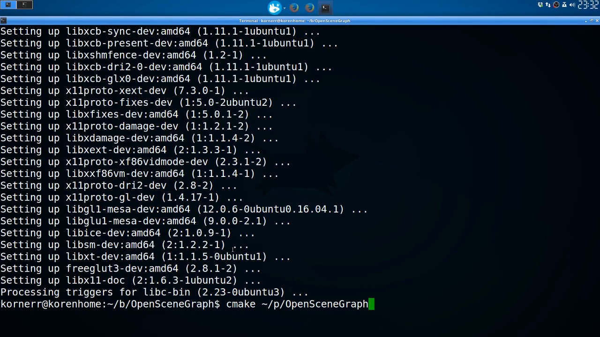

  Configure OpenSceneGraph once again. There are no OpenGL errors anymore.

<a name="step-gl-path"/>

1.2.11. Observe found OpenGL library location
---------------------------------------------

  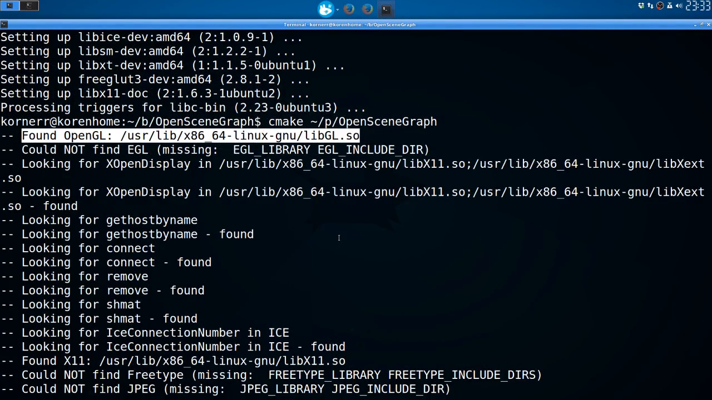

  As you see, configuration process has successfully found OpenGL libraries.

<a name="step-build"/>

1.2.12. Build OpenSceneGraph
----------------------------

  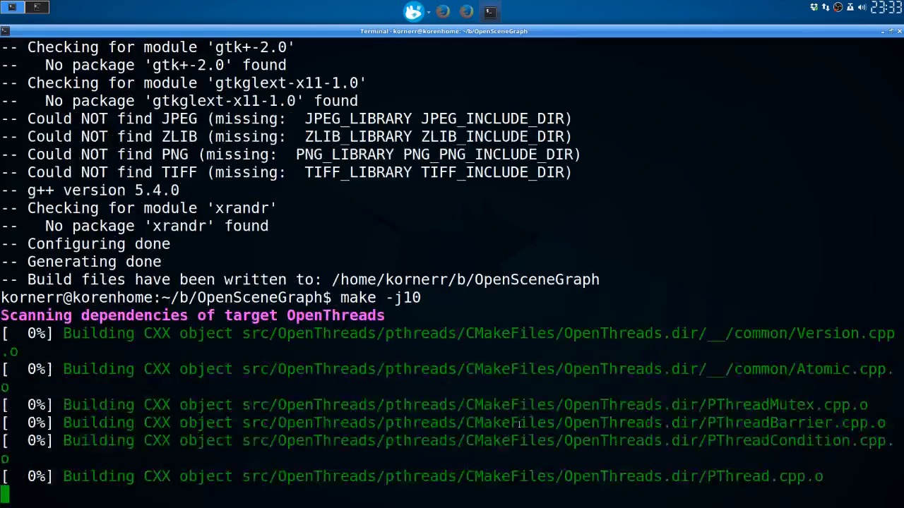

  We are finally ready to build OpenSceneGraph with the following command:

  `make -j10`

  We use `-j10` to run 10 parallel jobs. This makes building faster.

<a name="step-install"/>

1.2.13. Install OpenSceneGraph
------------------------------

  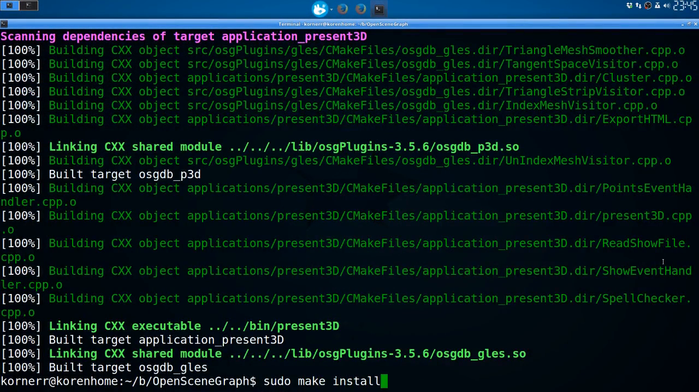

  Install OpenSceneGraph with the following command:

  `sudo make install`

<a name="step-try-check"/>

1.2.14. Try to check 'box.osgt' with 'osgviewer'
------------------------------------------------

  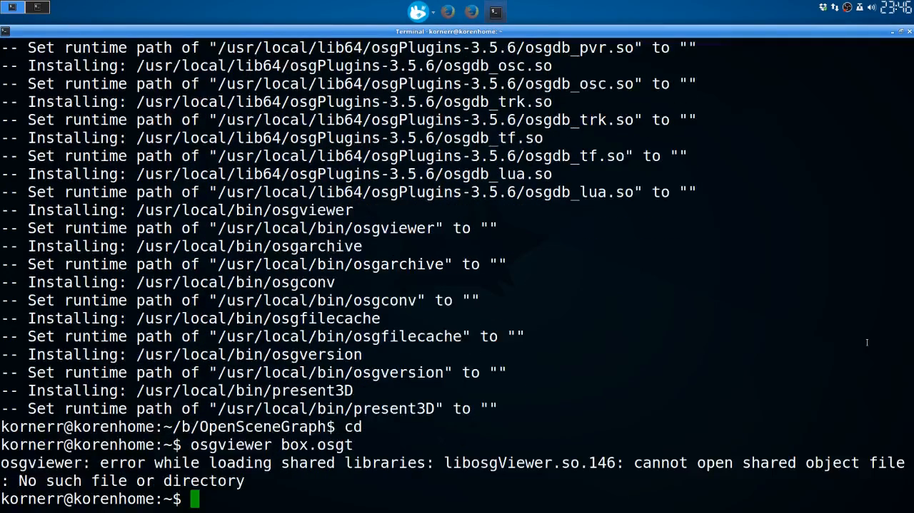
  
  Try to take a look at the cube with **osgviewer** tool.

  Turns out, it cannot find OpenSceneGraph libraries.

<a name="step-locate"/>

1.2.15. Locate OpenSceneGraph libraries
---------------------------------------

  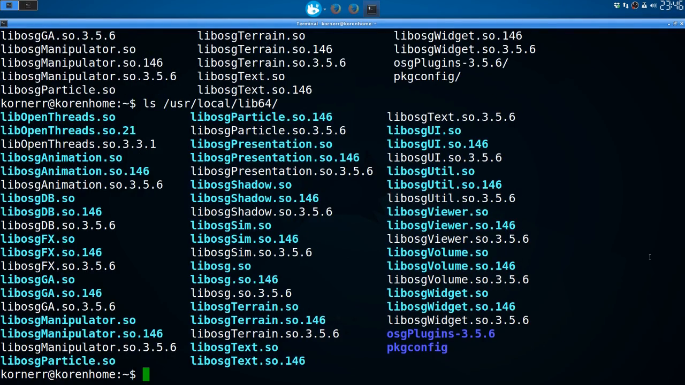

  By default, OpenSceneGraph libraries are installed into `/usr/local/lib64`
  on 64-bit Linux distributions. This location is not standard.

<a name="step-linker"/>

1.2.16. Tell dynamic linker where to find OpenSceneGraph libraries
------------------------------------------------------------------

  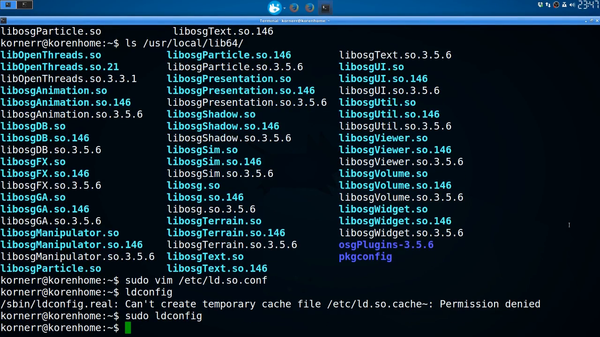

  Specify `/usr/local/lib64` inside `/etc/ld.so.conf` to make sure
  dynamic linker is aware of the directory with OpenSceneGraph libraries.

  Then refresh the linker cache with the following command:

  `sudo ldconfig`

<a name="step-check"/>

1.2.17. Check 'box.osgt' with 'osgviewer'
-------------------------------------

  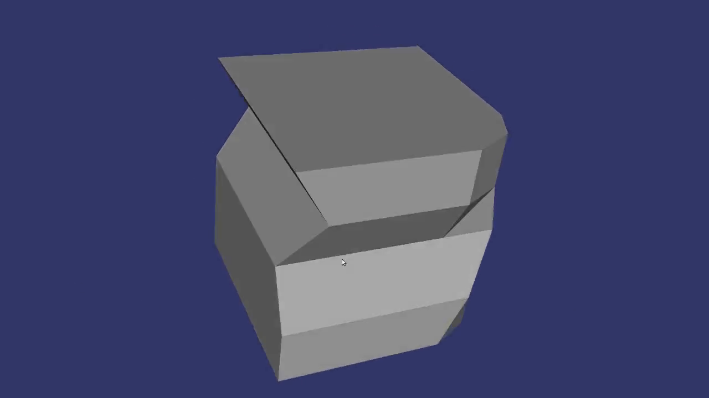

  Finally, take a look at the cube with **osgviewer** tool:

  `osgviewer /path/to/box.osgt`

