Table of contents
=================

* [Overview](#overview)
* [Video](#video)
* [Steps](#steps)
  * [1.4.1. Find Xcode](#step-find-xcode)
  * [1.4.2. Authorize at Apple Developer network site](#step-auth)
  * [1.4.3. Download Xcode](#step-download-xcode)
  * [1.4.4. Move Xcode to Applications](#step-move-xcode)
  * [1.4.5. Launch Xcode](#step-launch-xcode)
  * [1.4.6. Agree to open Xcode](#step-open-xcode)
  * [1.4.7. Accept Xcode and iOS SDK license agreement](#step-accept-xcode-license)
  * [1.4.8. Provide your password to install additional components](#step-install-addon)
  * [1.4.9. Find OpenSceneGraph repository](#step-find-osg)
  * [1.4.10. Get latest OpenSceneGraph](#step-get-osg)
  * [1.4.11. Create build directory](#step-build-dir)
  * [1.4.12. Find and download CMake](#step-get-cmake)
  * [1.4.13. Install CMake](#step-install-cmake)
  * [1.4.14. Launch CMake](#step-open-cmake)

<a name="overview"/>

Overview
========

This tutorial is part of [OpenSceneGraph cross-platform guide](http://github.com/OGStudio/openscenegraph-cross-platform-guide).

In this tutorial we install OpenSceneGraph under macOS and take a look
at the cube with **osgviewer** tool.

<a name="video"/>

Video
=====

[YouTube](https://todo) | [Download](readme/video.mp4)

Video depicts OpenSceneGraph installation under macOS El Capitan (10.11).

<a name="steps"/>

Steps
=====

<a name="step-find-xcode"/>

1.4.1. Find Xcode
-----------------

  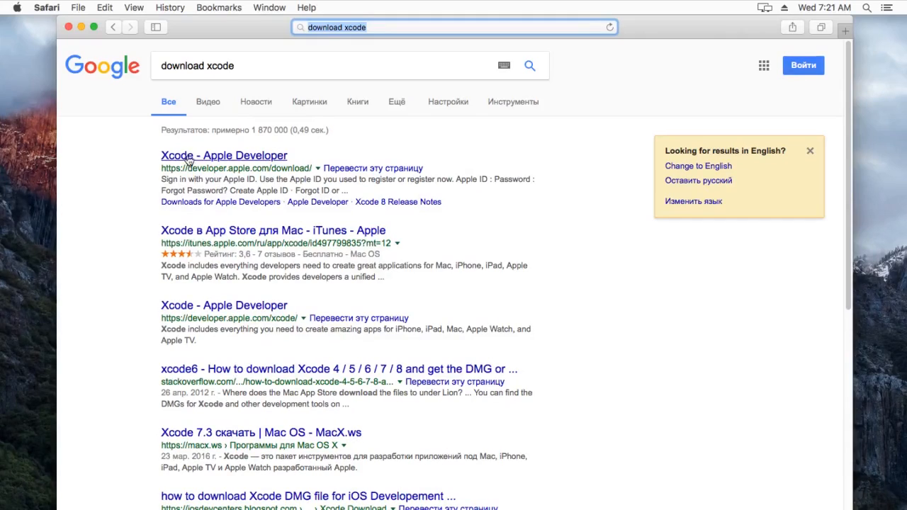

  [Xcode](http://developer.apple.com/xcode/) is an integrated development
  environment for macOS. It contains C/C++ compiler that we will use
  to build OpenSceneGraph.

<a name="step-auth"/>

1.4.2. Authorize at Apple Developer network site
------------------------------------------------

  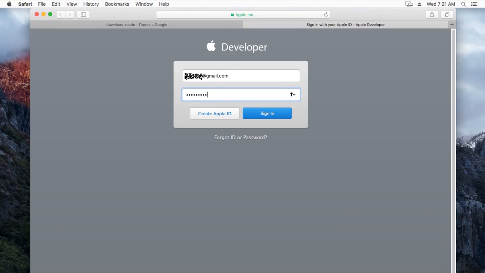

  You need a valid [Apple ID](http://appleid.apple.com) to download Xcode.

<a name="step-download-xcode"/>

1.4.3. Download Xcode
---------------------

  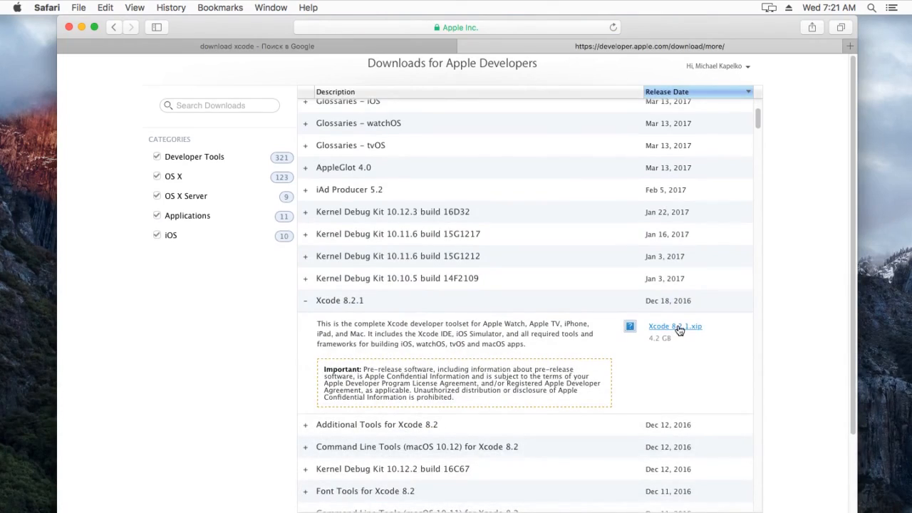

  Choose the latest Xcode version that suits your macOS version. In case
  of El Capitan, it's Xcode 8.2.

<a name="step-move-xcode"/>

1.4.4. Move Xcode to Applications
----------------------------------

  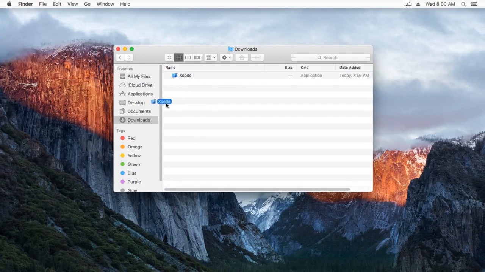

  Move Xcode from Downloads directory into Applications directory. This
  lets CMake, which we install later, find Xcode development
  tools without additional help.

<a name="step-launch-xcode"/>

1.4.5. Launch Xcode
-------------------

  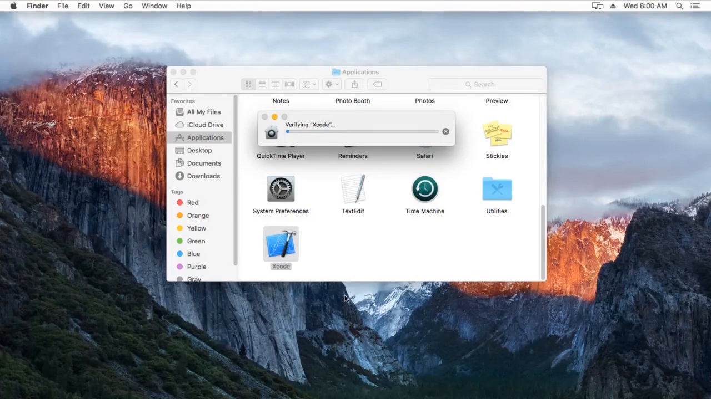

  Since Xcode has been downloaded from the Internet, macOS first verifies the file.
  This may take up some time.

<a name="step-open-xcode"/>

1.4.6. Agree to open Xcode
--------------------------

  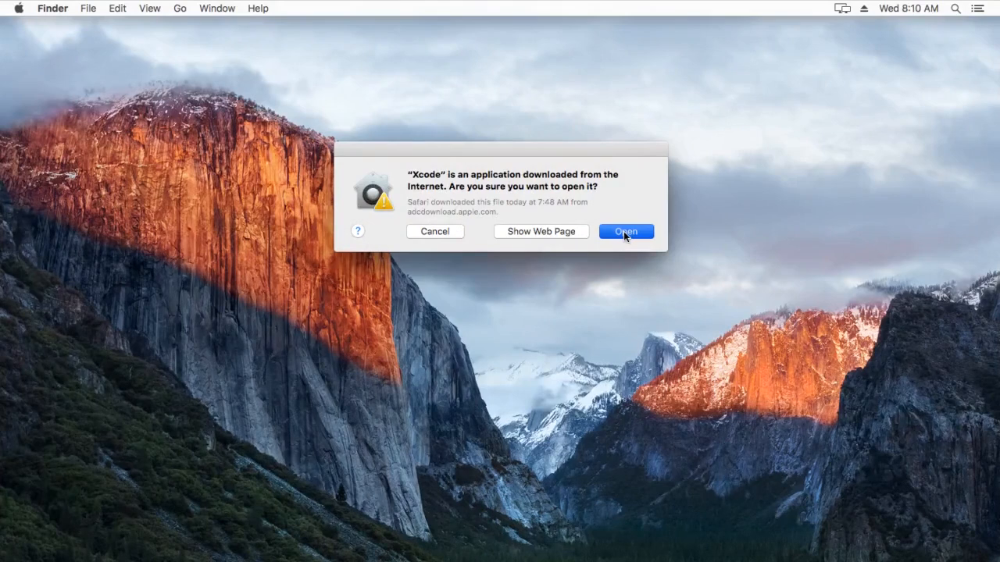

  Since Xcode has been downloaded from the Internet, macOS needs your
  permission to open the file.

<a name="step-accept-xcode-license"/>

1.4.7. Accept Xcode and iOS SDK license agreement
-------------------------------------------------

  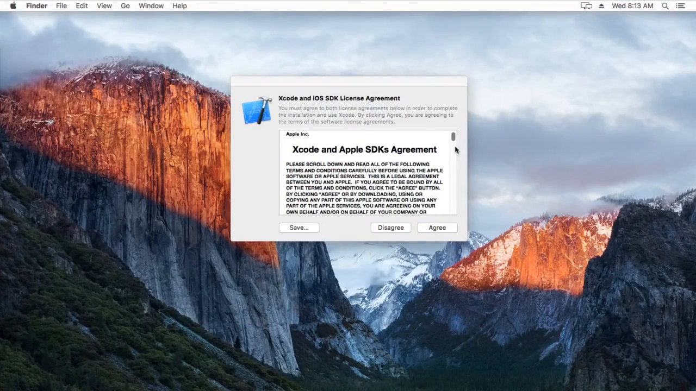

  Accept Xcode and iOS SDK license agreement to be able to use the product.

<a name="step-install-addon"/>

1.4.8. Provide your password to install additional components
-------------------------------------------------------------

  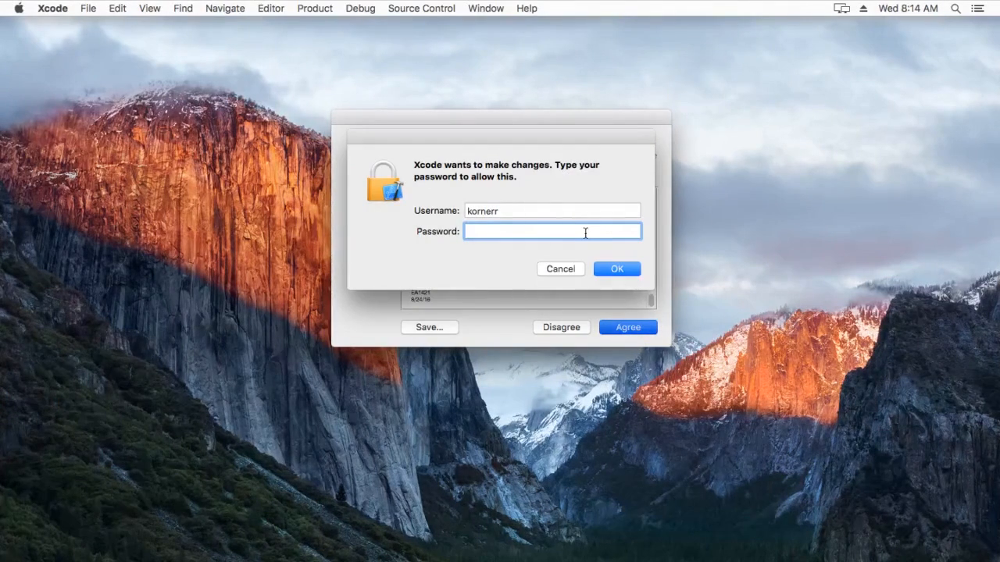

  Provide your password to allow Xcode to install necessary
  additional components like Git.
 
  Close Xcode after it has been launched.

<a name="step-find-osg"/>

1.4.9. Find OpenSceneGraph repository
-------------------------------------

  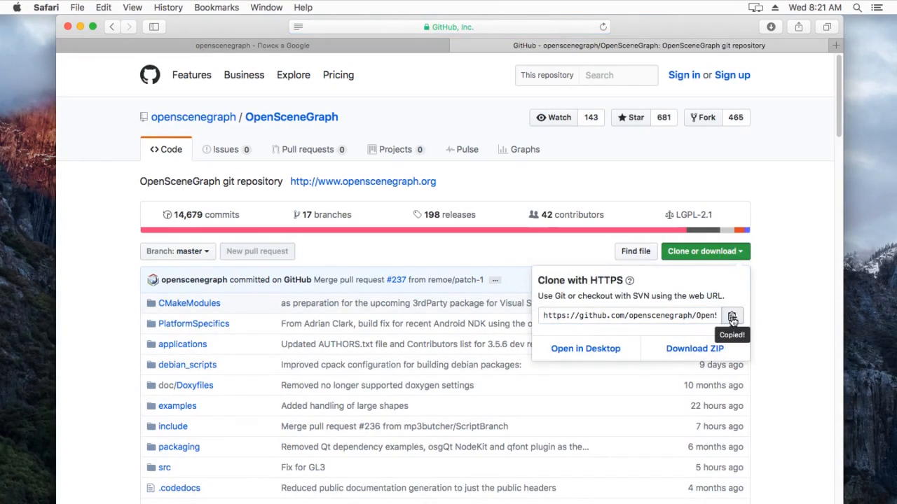

  Find OpenSceneGraph repository at the website.

<a name="step-get-osg"/>

1.4.10. Get latest OpenSceneGraph
---------------------------------

  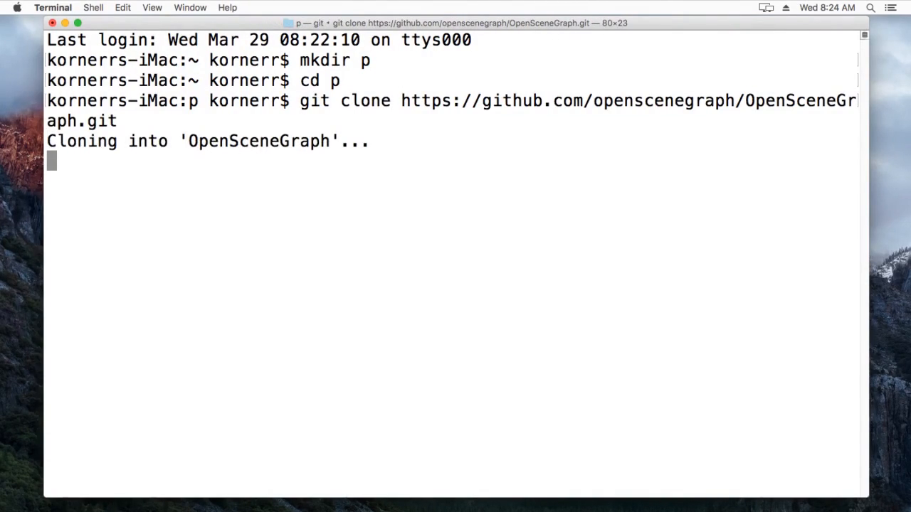

  Get the latest copy of OpenSceneGraph with the following command:

  `git clone https://github.com/openscenegraph/OpenSceneGraph.git`

<a name="step-build-dir"/>

1.4.11. Create build directory
------------------------------

  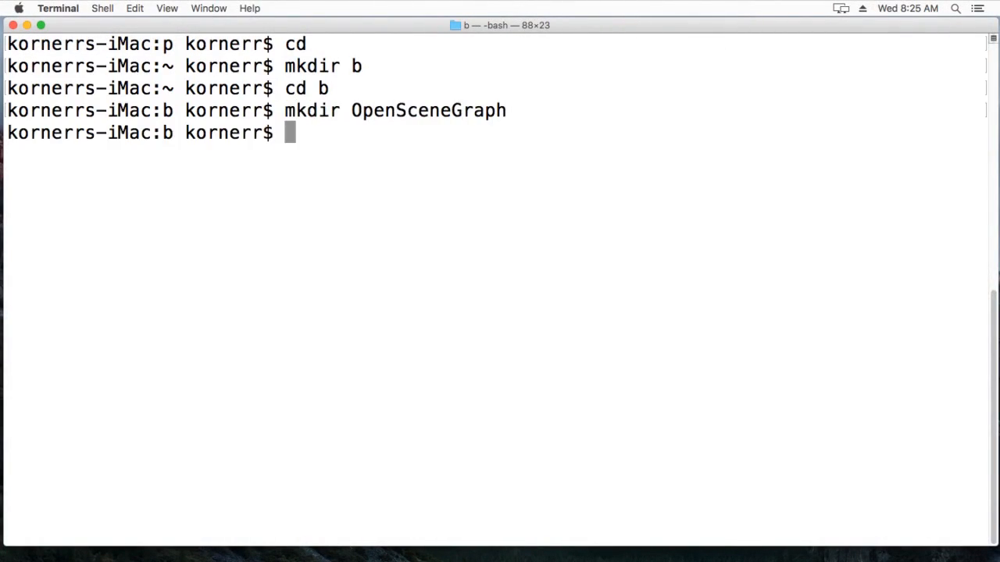
  
  OpenSceneGraph uses CMake build system, which supports out-of-source builds.
  We create a build directory to keep generated (built) content separate
  from the original source.

<a name="step-get-cmake"/>

1.4.12. Find and download CMake
-------------------------------

  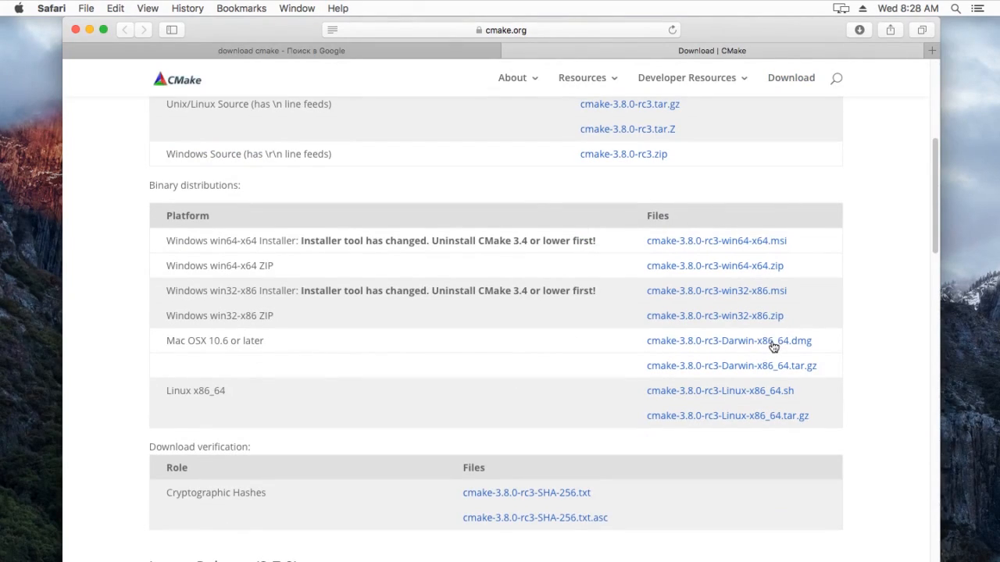
  
  Find CMake and download its macOS version.
 
<a name="step-install-cmake"/>

1.4.13. Install CMake
---------------------

  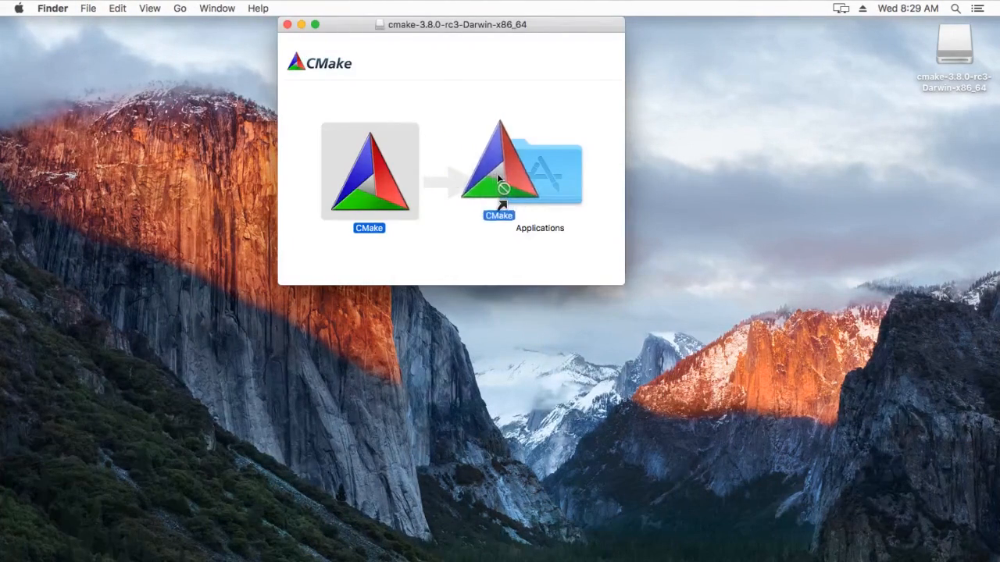

  Launch downloaded `dmg` package and follow instructions to install CMake.

<a name="step-open-cmake"/>

1.4.14. Launch CMake
--------------------

  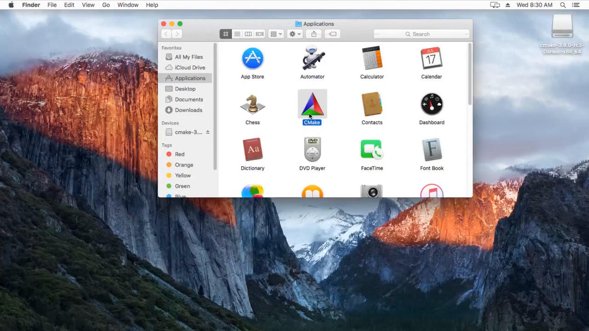

  Open CMake.

