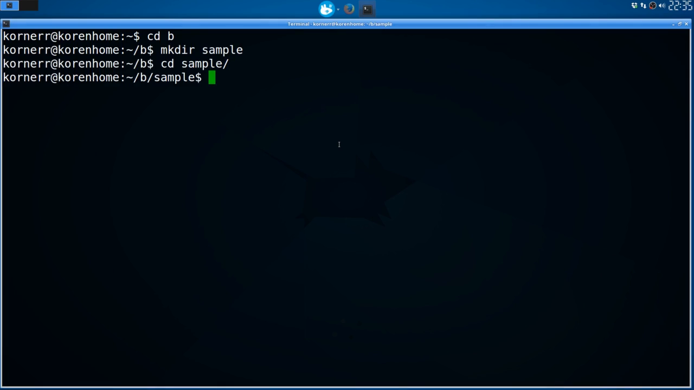
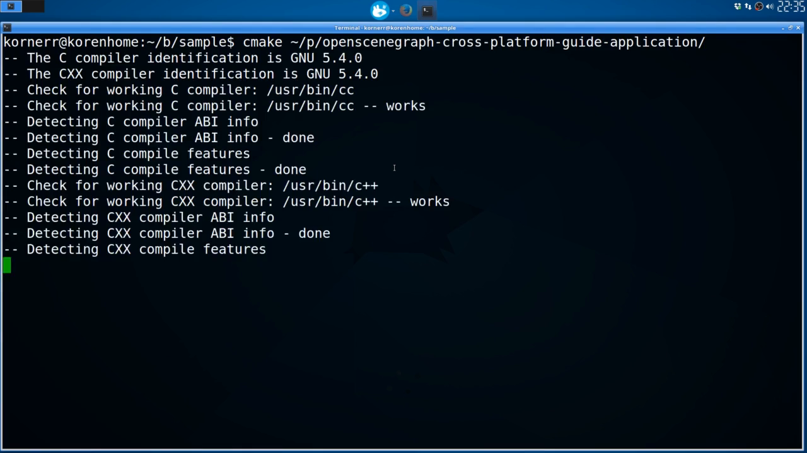
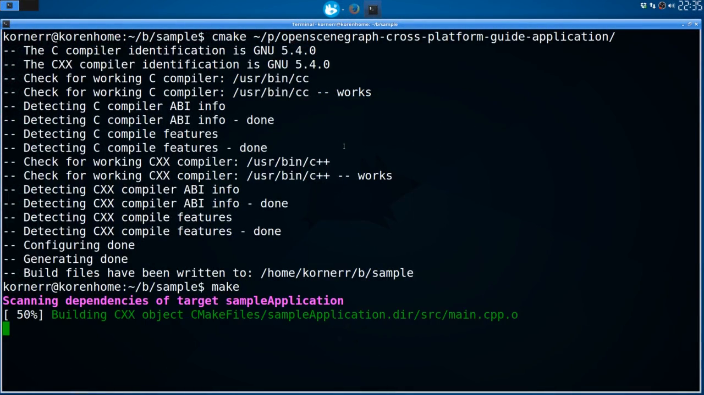

Table of contents
=================

* [Overview](#overview)
* [Video](#video)
* [Steps](#steps)
  * [1.5.1. Get sample application](#step-get)
  * [1.5.2. Create build directory](#step-build-dir)
  * [1.5.3. Configure the build](#step-cfg)
  * [1.5.4. Build application](#step-build)
  * [1.5.5. Run application](#step-run)

<a name="overview"/>

Overview
========

This tutorial is part of [OpenSceneGraph cross-platform guide](http://github.com/OGStudio/openscenegraph-cross-platform-guide).

In this tutorial we build [sample application](http://github.com/OGStudio/openscenegraph-cross-platform-guide-application)
under Linux. The application loads provided model and applies simple GLSL shaders.

<a name="video"/>

Video
=====

[YouTube](todo) | [Download](readme/video.mp4)

Video depicts sample application building under Xubuntu 16.04.

<a name="steps"/>

Steps
=====

<a name="step-get"/>

1.5.1. Get sample application
-----------------------------

  

  Get the latest copy of sample application with the following command:

  `git clone https://github.com/OGStudio/openscenegraph-cross-platform-guide-application.git`

<a name="step-build-dir"/>

1.5.2. Create build directory
-----------------------------

  

  Create a separate build directory for sample application, just as you did for
  OpenSceneGraph.

<a name="step-cfg"/>

1.5.3. Configure the build
--------------------------

  

  Configure sample application build with the following commands:
 
  `cd /path/to/build/dir`

  `cmake /path/to/source/dir`

<a name="step-build"/>

1.5.4. Build application
------------------------

  

  Build sample application with the following commands:

  `cd /path/to/build/dir`

  `make`

<a name="step-run"/>

1.5.5. Run application
----------------------

  

  Run sample application with the following commands:

  `cd /path/to/build/dir`

  `sampleApplication /path/to/box.osgt`

