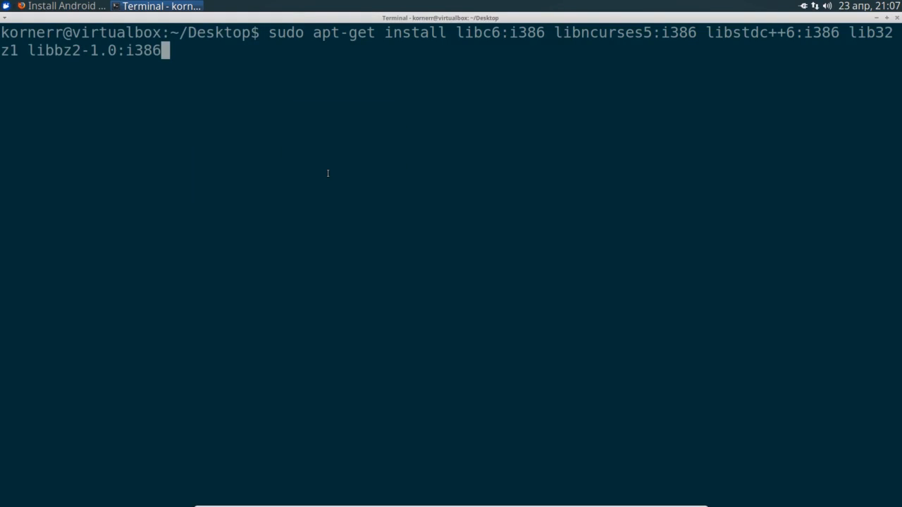
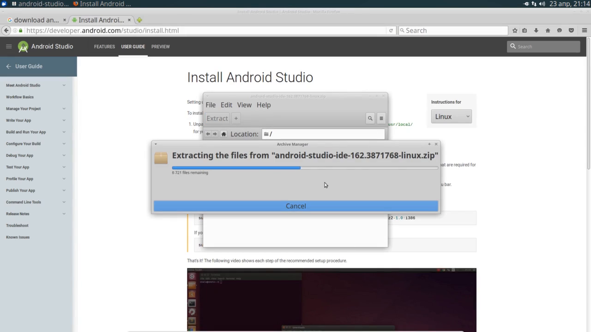

Table of contents
=================

* [Overview](#overview)
* [Video](#video)
* [Steps](#steps)
  * [1.8.1. Download Android Studio](#step-dl-as)
  * [1.8.2. Install 32-bit libraries](#step-32-libs)
  * [1.8.3. Unpack Android Studio](#step-unpack-as)

<a name="overview"/>

Overview
========

This tutorial is part of [OpenSceneGraph cross-platform guide](http://github.com/OGStudio/openscenegraph-cross-platform-guide).

In this tutorial we build and run
[sample OpenSceneGraph application](http://github.com/OGStudio/openscenegraph-cross-platform-guide-application)
under Android. The application displays provided model with simple GLSL shaders.

**Note**: this tutorial requires
* OpenSceneGraph model (see [1.1. Create a cube](../1.1.CreateCube))

<a name="video"/>

Video
=====

[YouTube](todo) | [Download](readme/video.mp4)

Video depicts running and building sample OpenSceneGraph application
with Android Studio 2.3.1 under Xubuntu 16.04.

<a name="steps"/>

Steps
=====

**Note**: steps below use frames from the video as screenshots.
Watch the video to see all details.

<a name="step-dl-as"/>

1.8.1. Download Android Studio
-----------------------------

  

  Download the latest version of Android Studio.
  It contains all the tools you need to develop for Android.

<a name="step-32-libs"/>

1.8.2. Install 32-bit libraries
-----------------------------

  

  According to [Android Studio installation instructions](https://developer.android.com/studio/install.html)
  64-bit Ubuntu needs several 32-bit libraries to make Android Studio work.

  Install necessary 32-bit libraries with the following command:

  `sudo apt-get install libc6:i386 libncurses5:i386 libstdc++6:i386 lib32z1 libbz2-1.0:i386`

<a name="step-unpack-as"/>

1.8.3. Unpack Android Studio
--------------------------

  

  Extract Android Studio archive into your home directory.

<a name="step-generate"/>

1.7.4. Generate Xcode project file
-----------------------------------

  

  Press `Generate` to generate Xcode specific project file.

<a name="step-try-build"/>

1.7.5. Try to build application
-------------------------------

  

  Try to build application with the following command:

  `xcodebuild -configuration Release`

  You may remember that we specified `-target install` during OpenSceneGraph
  building. Since sample application has no `install` target, we don't need
  to specify any `target`.

<a name="step-build-error"/>

1.7.6. Observe build error
--------------------------

  

  Building process could not find one of OpenSceneGraph headers, because
  OpenSceneGraph is installed in a non-standard directory.
  
<a name="step-cfg-all"/>

1.7.7. Reconfigure with OSG include and library directories
------------------------------------------------------------

  

  Since OpenSceneGraph has been installed into `/usr/local` directory,
  OpenSceneGraph header are located in `/usr/local/include` and libraries
  in `/usr/local/lib`. Specify these paths into `OSG_INC_DIR` and
  `OSG_LIB_DIR` variables correspondingly.

  Application's CMake file uses `OSG_INC_DIR` to search for additional headers
  and `OSG_LIB_DIR` to search for additional libraries.

<a name="step-regenerate"/>

1.7.8. Regenerate Xcode project file
------------------------------------

  

  Press `Generate` to regenerate Xcode specific project file.

<a name="step-build"/>

1.7.9. Build application
------------------------

  

  Build sample application with the following command:

  `xcodebuild -configuration Release`

<a name="step-run"/>

1.7.10. Run application
-----------------------

  

  Run sample application with the following command:

  `./Release/sampleApplication /path/to/box.osgt`

  **Note**: since we built `Release` configuration, binaries have been placed
  inside `Release` directory.

