Table of contents
=================

* [Overview](#overview)
* [Video](#video)
* [Steps](#steps)
  * [1.9.1. Create build directory](#step-build-dir)
  * [1.9.2. Launch CMake](#step-open-cmake)
  * [1.9.3. Specify build and source directories](#step-dirs)
  * [1.9.4. Configure osgNativeLib and OSG](#step-cfg)
  * [1.9.5. Generate Xcode project file](#step-generate)
  * [1.9.6. Build osgNativeLib and OSG](#step-build)
  * [1.9.7. Start a new Xcode project](#step-xcode)
  * [1.9.8. Select Single View Application](#step-single-view)
  * [1.9.9. Select Objective-C language](#step-objc)
  * [1.9.10. Finish project creation](#step-proj)
  * [1.9.11. Copy combined library](#step-copy-lib)
  * [1.9.12. Copy view controller and model](#step-copy)
  * [1.9.13. Add copied files to the project](#step-add)
  * [1.9.14. Select RenderVC as the main interface](#step-main)
  * [1.9.15. Reference osgNativeLib headers](#step-headers)
  * [1.9.16. Run the project](#step-run)

<a name="overview"/>

Overview
========

This tutorial is part of [OpenSceneGraph cross-platform guide](http://github.com/OGStudio/openscenegraph-cross-platform-guide).

In this tutorial we build and run
[sample OpenSceneGraph application](http://github.com/OGStudio/openscenegraph-cross-platform-guide-application)
under iOS. The application displays provided model with simple GLSL shaders.

**Note**: this tutorial requires
* OpenSceneGraph model (see [1.1. Create a cube](../1.1.CreateCube))
* Xcode and CMake installations (see [1.4. Install OpenSceneGraph under macOS](../1.4.InstallUnderMacOS))
* OpenSceneGraph sources (see [1.4. Install OpenSceneGraph under macOS](../1.4.InstallUnderMacOS))
* sample OpenSceneGraph application sources (see [1.7. Build and run sample OpenSceneGraph application under macOS](../1.7.SampleUnderMacOS)) **alongside OpenSceneGraph sources**

<a name="video"/>

Video
=====

[YouTube](https://youtu.be/VJw7_L4FJGo) | [Download](readme/video.mp4)

Video depicts running and building sample OpenSceneGraph application
for iOS simulator with iOS 10.

<a name="steps"/>

Steps
=====

**Note**: steps below use frames from the video as screenshots.
Watch the video to see all details.

<a name="step-build-dir"/>

1.9.1. Create build directory
-----------------------------

  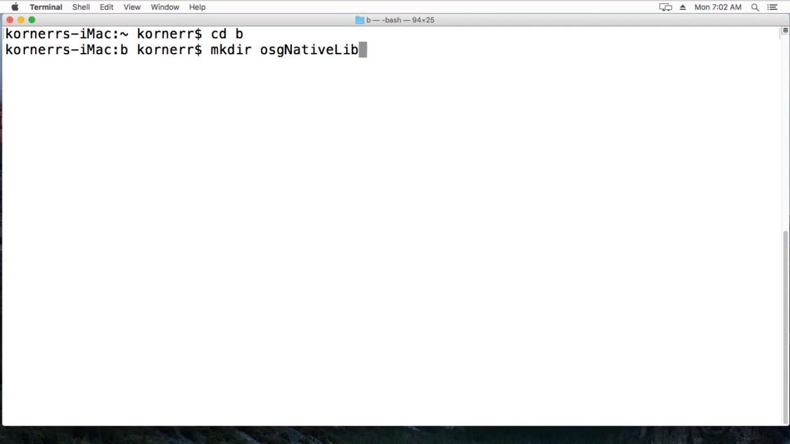

  Create build directory for iOS simulator build of osgNativeLib,
  a native C++ library to be used in Objective-C.

  osgNativeLib also builds OpenSceneGraph inside
  `/path/to/openscenegraph-cross-platform-guide-application/../OpenSceneGraph/build/Simulator`.

  **Note**: iOS simulator build only works under iOS simulator. If you need
  to build for a real device, you need to build osgNativeLib
  with `BUILD_SIMULATOR=NO` in a separate directory. In such a case
  OpenSceneGraph is built inside
  `/path/to/openscenegraph-cross-platform-guide-application/../OpenSceneGraph/build/Device`.

<a name="step-open-cmake"/>

1.9.2. Launch CMake
-------------------

  

  Open CMake

<a name="step-dirs"/>

1.9.3. Specify build and source directories
-------------------------------------------

  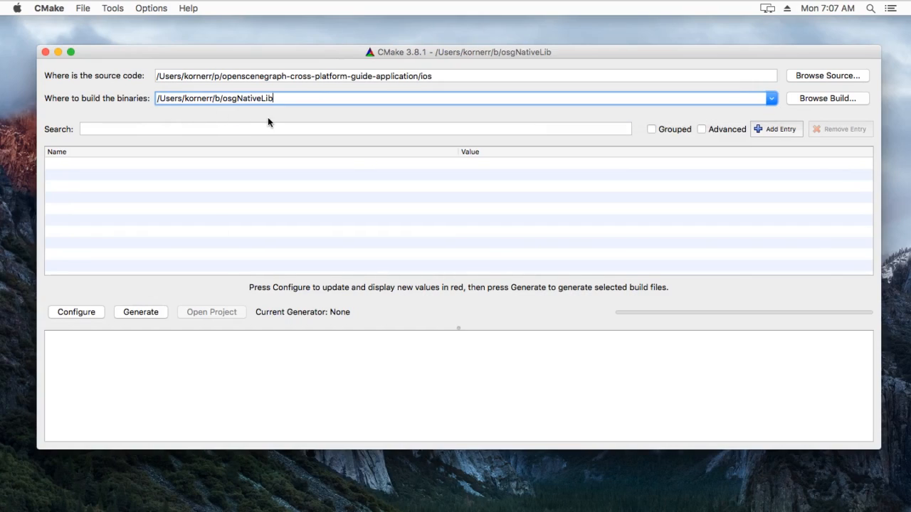

  Specify build and source directories.

<a name="step-cfg"/>

1.9.4. Configure osgNativeLib and OSG
-------------------------------------

  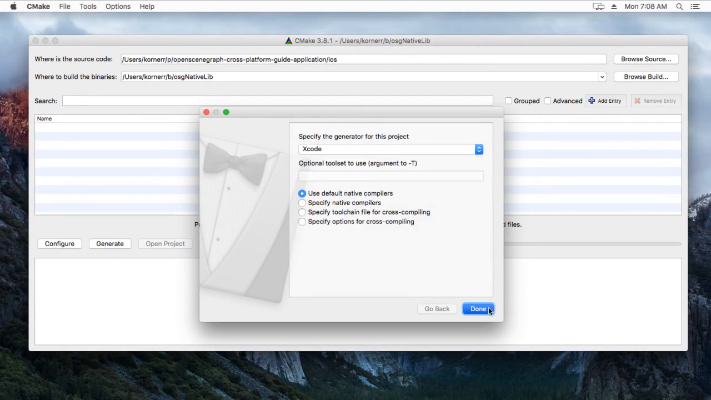

  Press `Configure`. Select `Xcode` generator when prompted.

<a name="step-generate"/>

1.9.5. Generate Xcode project file
-----------------------------------

  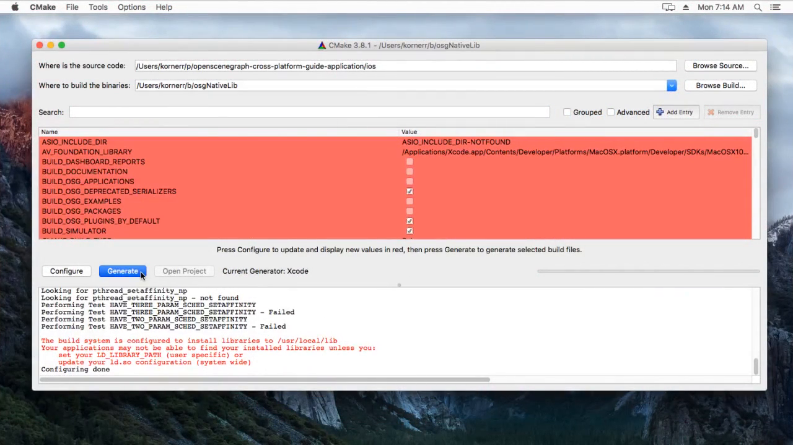

  Press `Generate` to generate Xcode specific project file.

<a name="step-build"/>

1.9.6. Build osgNativeLib and OSG
---------------------------------

  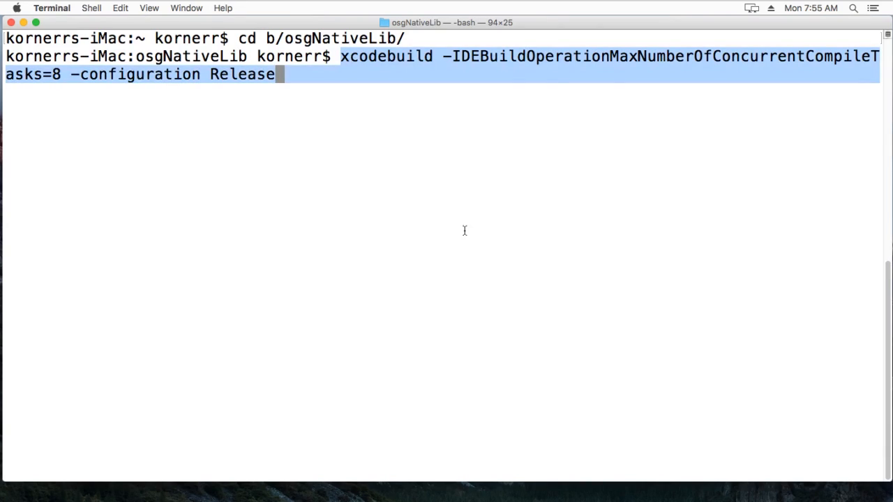

  Build osgNativeLib and OpenSceneGraph with the following commands:

  `cd /path/to/build/dir`

  `xcodebuild -IDEBuildOperationMaxNumberOfConcurrentCompileTasks=8 -configuration Release`

  At the end the build process combines osgNativeLib and several OpenSceneGraph
  libraries into single `libosglib.a` library. This is done for convenience.

<a name="step-xcode"/>

1.9.7. Start a new Xcode project
--------------------------------

  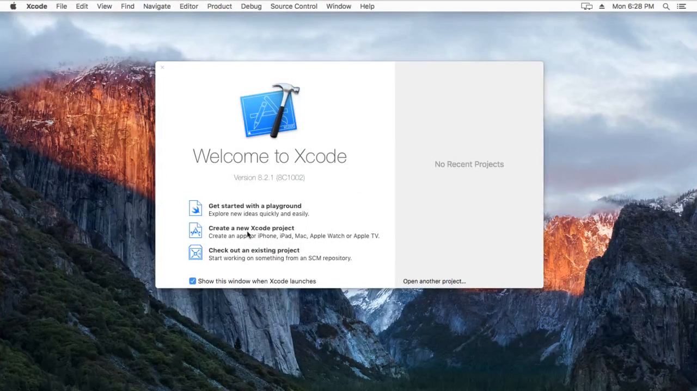

  Start a new Xcode project.

<a name="step-single-view"/>

1.9.8. Select Single View Application
--------------------------------

  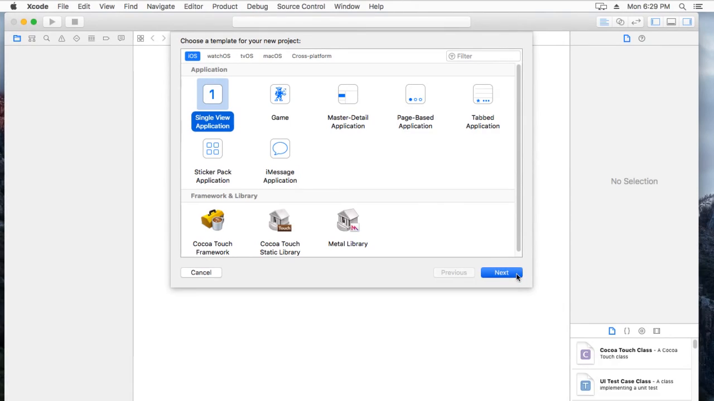

  Select Single View Application.

<a name="step-objc"/>

1.9.9. Select Objective-C language
----------------------------------

  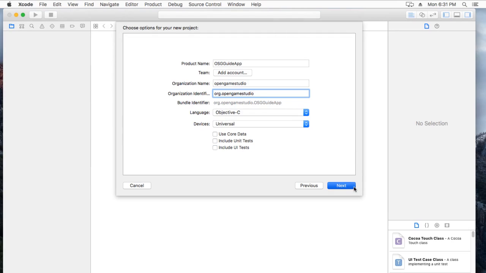

  Select Objective-C language and provide application specific
  information like title, organization, etc.

<a name="step-proj"/>

1.9.10. Finish project creation
-------------------------------

  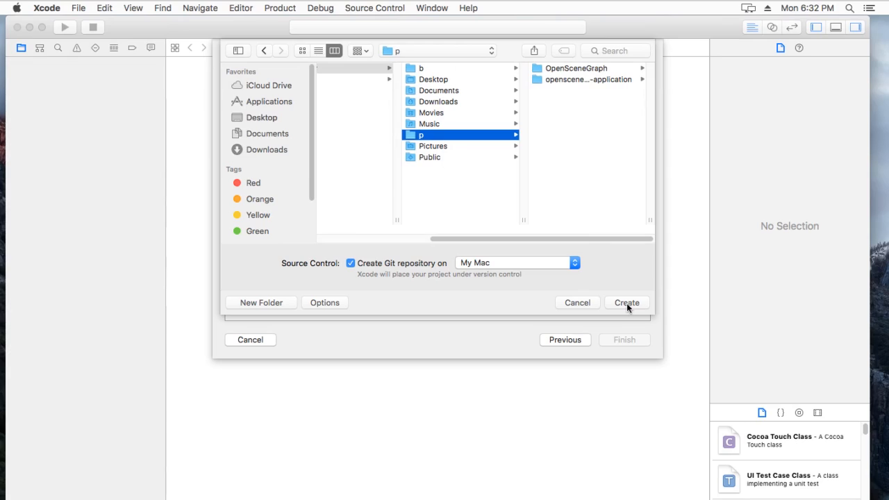

  Select project directory and finish project creation.

<a name="step-copy-lib"/>

1.9.11. Copy combined library
-----------------------------

  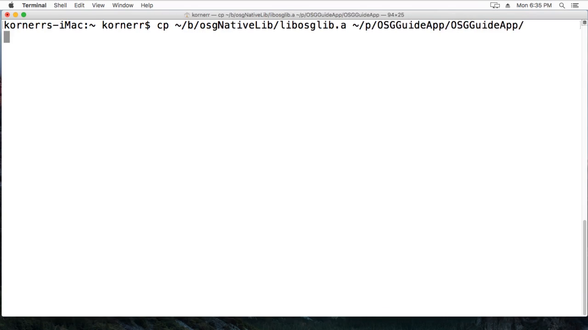

  Copy combined library into project directory with the following command:

  `cp /path/to/build/dir/libosglib.a /path/to/xcode/project/subdir/`

<a name="step-copy"/>

1.9.12. Copy view controller and model
--------------------------------------

  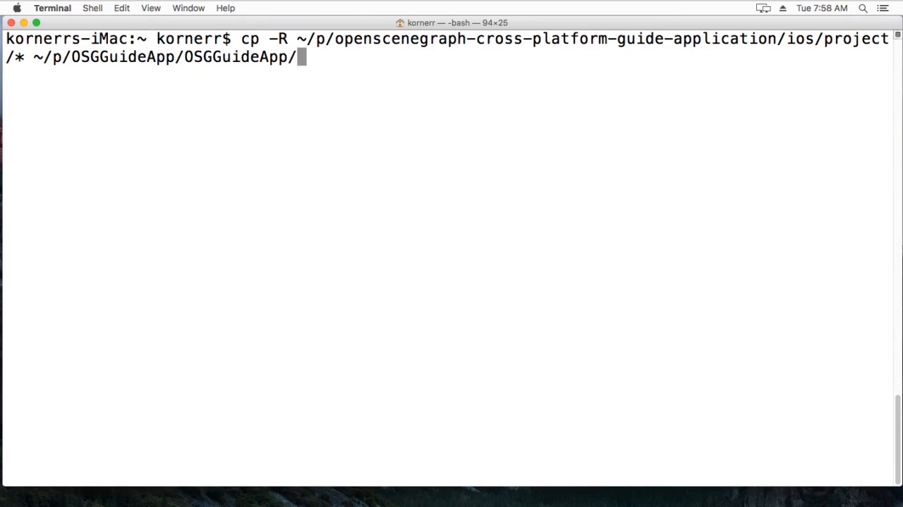

  Copy view controller and model with the following command:

  `cp -R /path/to/openscenegraph-cross-platform-guide-application/ios/project/* /path/to/xcode/project/subdir`
  
  Sample OpenSceneGraph application's *ios/project* directory contains
  a box model and `RenderVC`. `RenderVC` is a view controller that renders
  the model with osgNativeLib.

<a name="step-add"/>

1.9.13. Add copied files to the project
---------------------------------------

  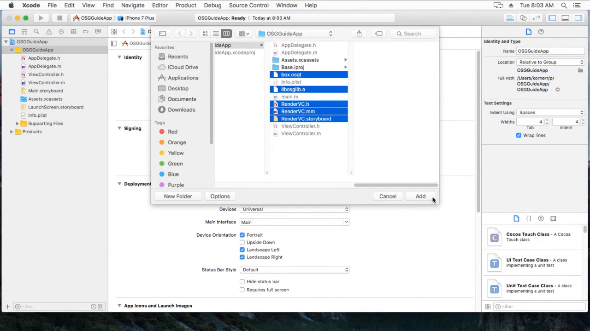

  For Xcode to see the files, they should be added to the project.

<a name="step-main"/>

1.9.14. Select RenderVC as the main interface
---------------------------------------------

  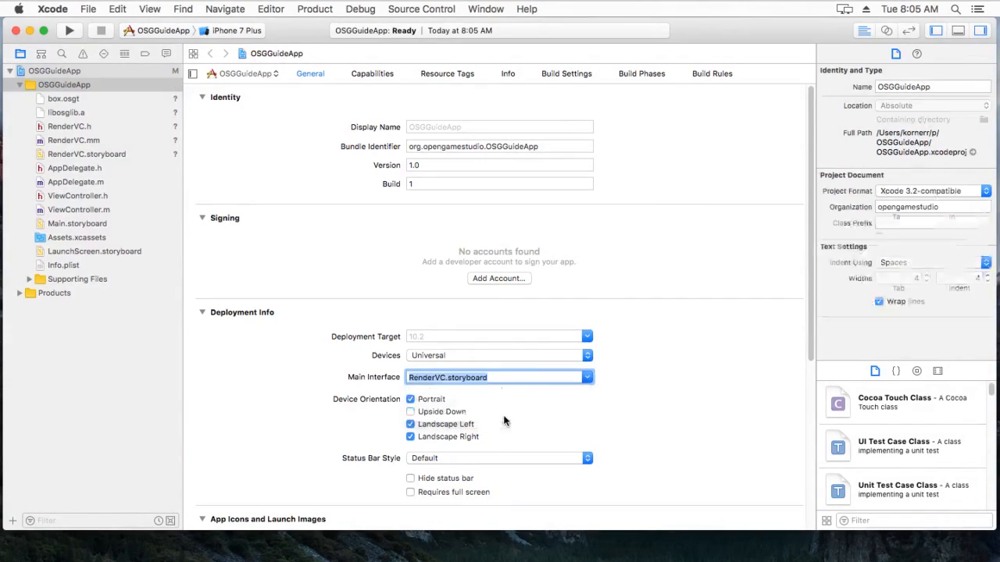

  Go to `General` project page and select `RenderVC.storyboard` as
  the main interface.

<a name="step-headers"/>

1.9.15. Reference osgNativeLib headers
--------------------------------------

  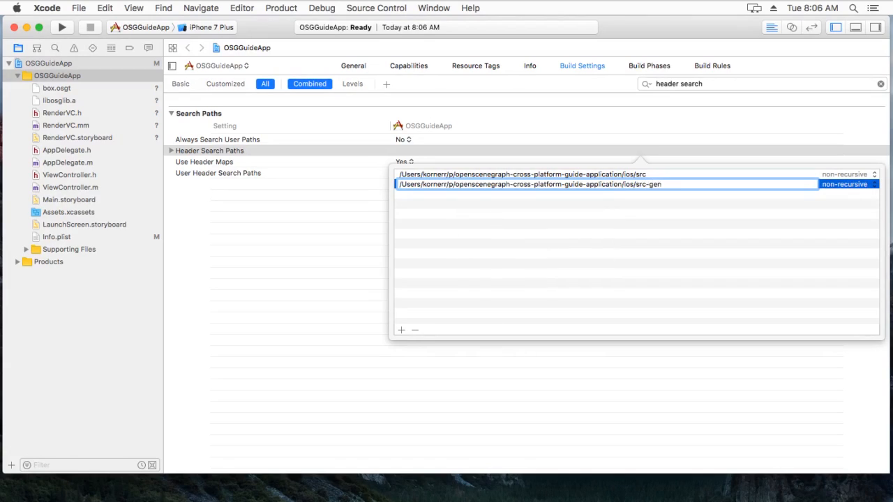

  Since we have not added osgNativeLib headers to the project, we should
  reference them to be able to call osgNativeLib functions.

  Go to project's `Build Settings`, find `Header Search Paths` section,
  then add the following search paths:

  `/path/to/openscenegraph-cross-platform-guide-application/ios/src`

  `/path/to/openscenegraph-cross-platform-guide-application/ios/src-gen`

<a name="step-run"/>

1.9.16. Run the project
-----------------------

  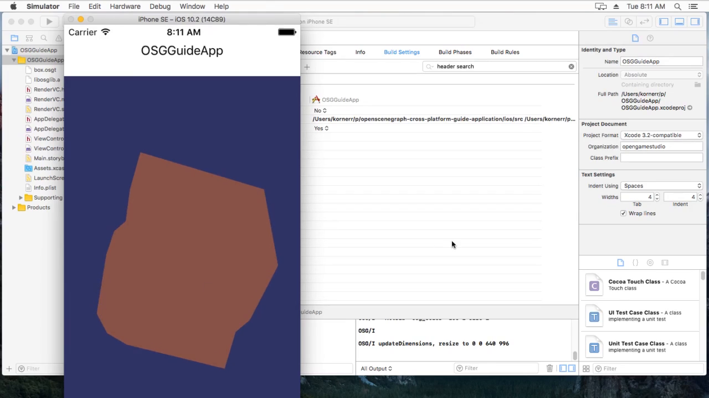

  Select iPhone simulator and run the project.
  You should see red cube displayed.

