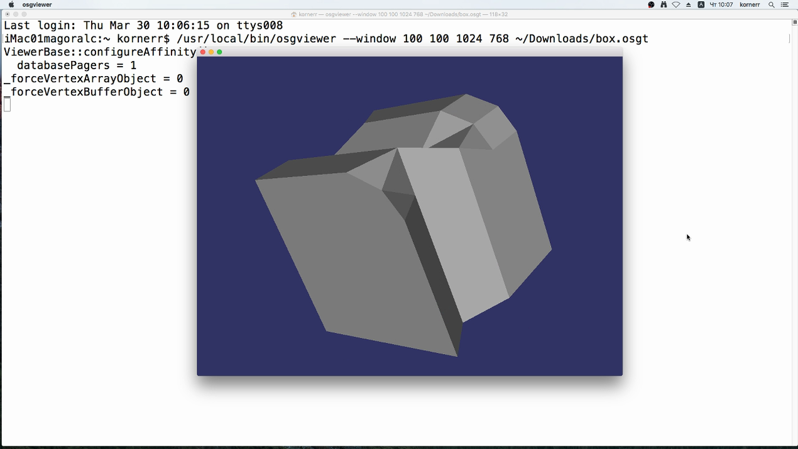
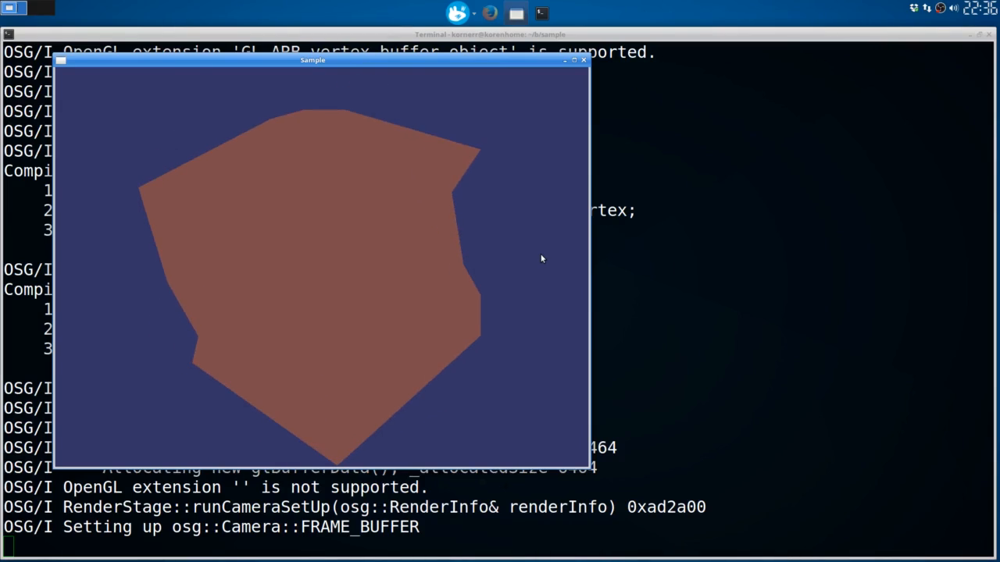
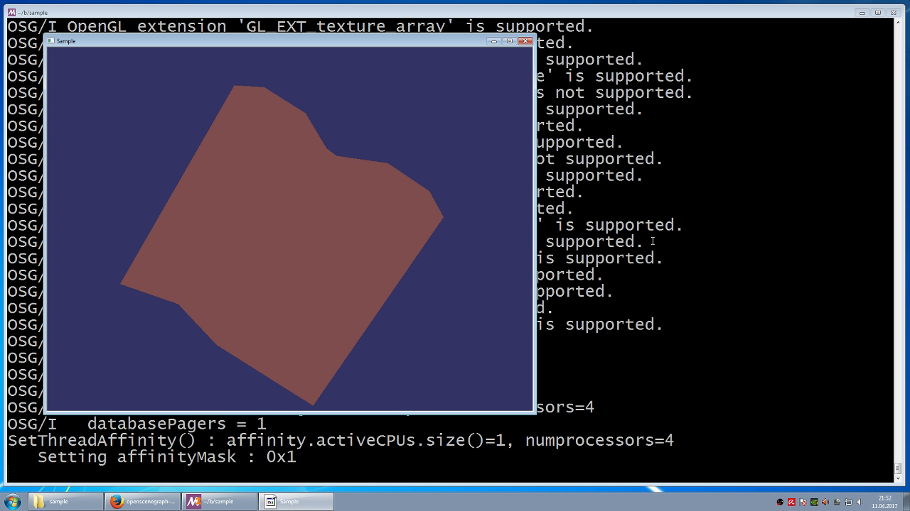
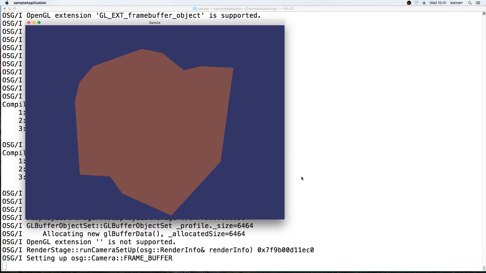
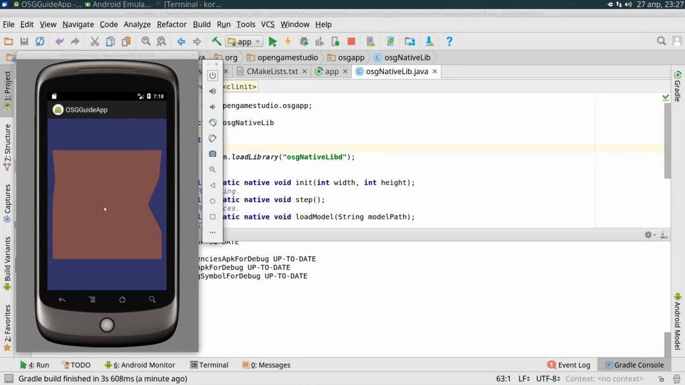
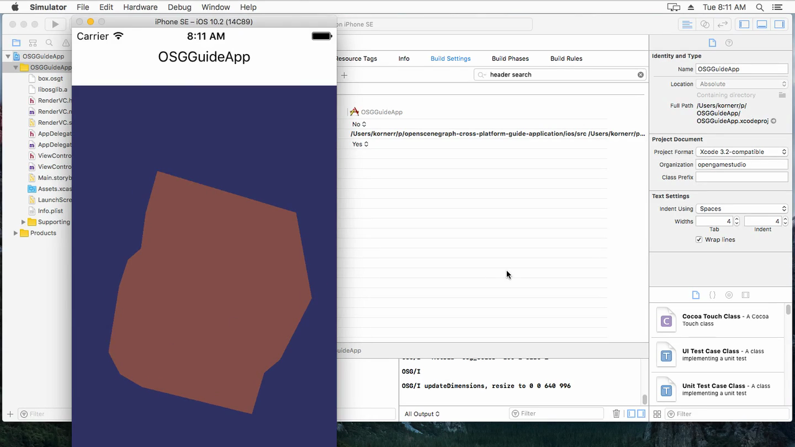
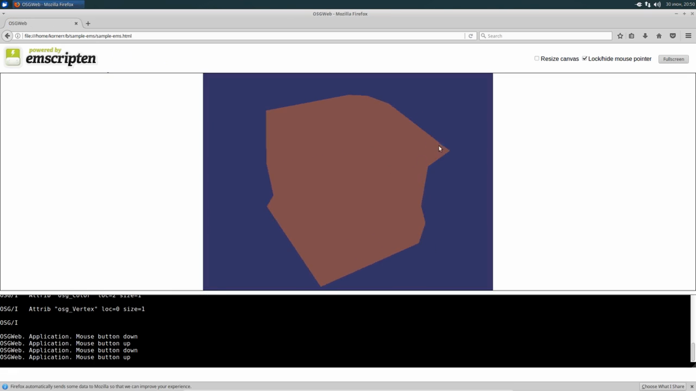

Table of contents
=================

* [Overview](#overview)
* [Continuous numbering convention](#numbering)
* [Tutorials](#tutorials)
  * [1.1. Create a cube](#tutorials-cube)
  * [1.2. Install OpenSceneGraph under Linux](#tutorials-install-linux)
  * [1.3. Install OpenSceneGraph under Windows](#tutorials-install-windows)
  * [1.4. Install OpenSceneGraph under macOS](#tutorials-install-macos)
  * [1.5. Build and run sample OpenSceneGraph application under Linux](#tutorials-sample-linux)
  * [1.6. Build and run sample OpenSceneGraph application under Windows](#tutorials-sample-windows)
  * [1.7. Build and run sample OpenSceneGraph application under macOS](#tutorials-sample-macos)
  * [1.8. Build and run sample OpenSceneGraph application under Android](#tutorials-sample-android)
  * [1.9. Build and run sample OpenSceneGraph application under iOS](#tutorials-sample-ios)
  * [1.10. Build and run sample OpenSceneGraph application in Web](#tutorials-sample-web)
* [Help](#help)

<a name="overview"/>

Overview
========

[OpenSceneGraph](http://openscenegraph.org) is an open source high performance
3D graphics toolkit, used by application developers in fields such as visual
simulation, games, virtual reality, scientific visualization and modelling.

It uses OpenGL (including ES) to perform 3D rendering.

This guide explains how to render a simple 3D model using OpenSceneGraph
under the following platforms:

* Linux
* macOS
* Windows
* Android
* iOS
* Web

<a name="numbering"/>

Continuous numbering convention
===============================

This guide uses continuous numbering with topics denoted as
**Number1**.**Number2** (e.g., **1.1**) and concrete steps denoted as
**Number1**.**Number2**.**Number3** (e.g., **1.1.1**).

Here's what each number means:

* **Number1** is the guide number. In our case, it's the first guide, so it's **1**.
* **Number2** is a specific topic. In the case of creating a cube, it's **1.1**.
* **Number3** is a concrete step of the topic. In the case of installing Blender, it's **1.1.1**.

<a name="tutorials"/>

Tutorials
=========

<a name="tutorials-cube"/>

### [1.1. Create a cube](1.1.CreateCube)

  

  Create a simple cube that OpenSceneGraph will render later.

<a name="tutorials-install-linux"/>

### [1.2. Install OpenSceneGraph under Linux](1.2.InstallUnderLinux)

  

  Install OpenSceneGraph under Linux and take a look at the cube
  with **osgviewer** tool.

<a name="tutorials-install-windows"/>

### [1.3. Install OpenSceneGraph under Windows](1.3.InstallUnderWindows)

  

  Install OpenSceneGraph under Windows and take a look at the cube
  with **osgviewer** tool.

<a name="tutorials-install-macos"/>

### [1.4. Install OpenSceneGraph under macOS](1.4.InstallUnderMacOS)

  

  Install OpenSceneGraph under macOS and take a look at the cube
  with **osgviewer** tool.

<a name="tutorials-sample-linux"/>

### [1.5. Build and run sample OpenSceneGraph application under Linux](1.5.SampleUnderLinux)

  

  Build and run sample OpenSceneGraph application under Linux.

<a name="tutorials-sample-windows"/>

### [1.6. Build and run sample OpenSceneGraph application under Windows](1.6.SampleUnderWindows)

  

  Build and run sample OpenSceneGraph application under Windows.

<a name="tutorials-sample-macos"/>

### [1.7. Build and run sample OpenSceneGraph application under macOS](1.7.SampleUnderMacOS)

  

  Build and run sample OpenSceneGraph application under macOS.

<a name="tutorials-sample-android"/>

### [1.8. Build and run sample OpenSceneGraph application under Android](1.8.SampleUnderAndroid)

  

  Build and run sample OpenSceneGraph application under Android.

<a name="tutorials-sample-ios"/>

### [1.9. Build and run sample OpenSceneGraph application under iOS](1.9.SampleUnderIOS)

  

  Build and run sample OpenSceneGraph application under iOS.

<a name="tutorials-sample-web"/>

### [1.10. Build and run sample OpenSceneGraph application in Web](1.10.SampleWeb)

  

  Build and run sample OpenSceneGraph application in Web.

<a name="help"/>

Help
====

If you have problems with any of the tutorials,
[create an issue](https://github.com/OGStudio/openscenegraph-cross-platform-guide/issues).
We'll sort it out together.
